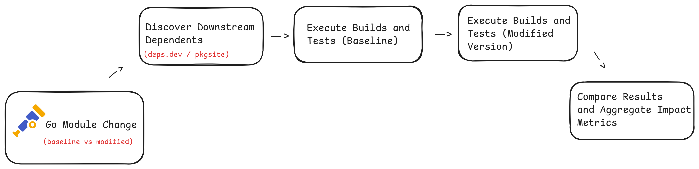

# Problem Understanding: Measuring Downstream Impact of Go Library Changes

## Overview 

Go is one of the primary implementation language across the CNCF ecosystem.
Many critical projects depend on shared [Go modules](https://go.dev/blog/using-go-modules) that are maintained
independently but consumed transitively across large dependency graphs.

[OpenTelemetry](https://opentelemetry.io/) is a representative example of such a module set. Its Go
[SDKs](https://opentelemetry.io/docs/languages/go/) and the [OpenTelemetry Collector](https://opentelemetry.io/docs/collector/) are imported directly or indirectly
by projects such as [Kubernetes](https://opentelemetry.io/docs/platforms/kubernetes/), [Jaeger](https://opentelemetry.io/docs/languages/dotnet/traces/jaeger/), and numerous observability and
platform integrations.

In this context, changes to a single Go module version can propagate
through module resolution and affect downstream build and test behavior
outside the control of the original maintainer.

## Existing Change Evaluation in Go

The Go ecosystem provides tooling to reason about compatibility at the
API level. Tools such as [apidiff](https://pkg.go.dev/golang.org/x/exp/apidiff) operate by
comparing exported symbols between two versions of a module and
identifying breaking changes such as:

- **Removed or renamed identifiers** - Detects when public functions, methods, or types are no longer available to downstream consumers.
- **Modified function signatures** - Identifies changes in parameter types, return values, or visibility that would cause compile-time failures.
- **Type definition changes** - Captures structural changes to exported types that violate Go’s compatibility guarantees.

These tools are effective at identifying violations of Go’s compatibility
guidelines for public APIs. However, they operate purely on static
interface comparison and do not execute code.

As a result, they cannot detect:

- Behavioral changes behind stable APIs
- Breakage caused by indirect or transitive dependencies
- Changes that affect runtime behavior, initialization order, or test
  assumptions in downstream projects

## Gap Between API Compatibility and Downstream Compatibility

In practice, downstream projects encode expectations through:

- **Build configurations** - Project-specific build flags, CI pipelines, and platform assumptions that may break even when APIs remain unchanged.
- **Dependency version constraints** - Transitive dependency resolution and version pinning that can surface conflicts after an upstream change.
- **Integration and end-to-end tests** - Tests that validate real runtime behavior, cross-component interactions, and system-level assumptions.

A change that preserves exported APIs may still cause downstream failures
due to altered behavior, timing, configuration defaults, or interactions
with other dependencies.

Because these effects are not observable through static analysis alone,
maintainers currently rely on manual reasoning or post-release feedback
to discover downstream breakage.

This creates a gap between API compatibility guarantees and actual
downstream compatibility.

## Role of Downstream Test Execution

Downstream test suites already represent executable specifications of
expected behavior. Running these tests against different versions of a
dependency provides direct evidence of compatibility.

At a technical level, this requires the ability to:

1. Identify downstream modules that depend on a given Go module as [GitHub code search](https://docs.github.com/en/rest/search/search) or module indexes. 
2. Evaluate downstream projects against controlled versions of the upstream module using [Go](https://go.dev/ref/mod) modules.
3. Execute `go test ./...` (or equivalent build steps) in isolation. ([Resource](https://pkg.go.dev/cmd/go#hdr-Test_packages))
4. Capture and compare results across versions

This approach complements API diff tools by validating real execution
paths rather than interface shape alone.

## Relevance to OpenTelemetry

OpenTelemetry provides Go libraries and a collector framework that are
embedded directly into application runtimes and telemetry pipelines.Many 
consuming codebases rely on these components for behavior beyond exported 
APIs, including initialization logic, configuration handling, and runtime
interaction with metrics, traces, and logs.

As a result, changes to OpenTelemetry Go modules can affect downstream
projects even when public APIs remain stable. Such effects are typically
exercised only at build or test time, where assumptions about behavior,
dependency resolution, or execution order are validated.

Because OpenTelemetry modules are widely reused as shared dependencies,
they provide a practical and high-signal starting point for evaluating a
tool that measures downstream impact through empirical build and test
execution.

## Interpreting Downstream Impact

Executing builds and test suites across multiple dependent codebases
produces observable signals that can be compared across versions of a Go
module. These signals reflect actual compatibility as exercised by real
usage patterns rather than theoretical interface guarantees.

By aggregating results across a set of dependents, it becomes possible to
identify newly introduced failures, unchanged failures, and unaffected
codebases. This enables impact assessment in terms of scope and severity,
providing a data-driven complement to API-level change analysis.

References:

[Go testing toolchain](https://pkg.go.dev/cmd/go#hdr-Test_packages)

[Go module versioning](https://go.dev/ref/mod)

## High-Level Workflow

## Project Objective

The current prototype implements the first foundational stage of the proposed system: **automated discovery of dependent Go modules**.

Using  GitHub’s code search [API](https://docs.github.com/en/rest/search/search), the prototype identifies repositories whose `go.mod` files 
reference a target Go module (for example, `go.opentelemetry.io/otel`). Providing a practical approximation of downstream dependency relationships 
that can be executed reliably without requiring centralized dependency metadata.

This dependency discovery step establishes the input set required for subsequent stages of the workflow, including controlled version resolution, downstream 
build and test execution, and comparative result analysis.
